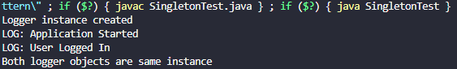
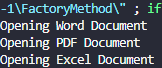
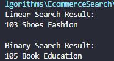
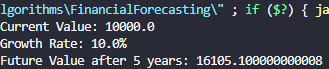
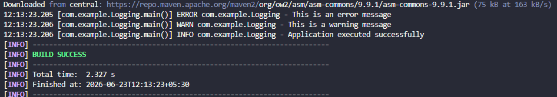
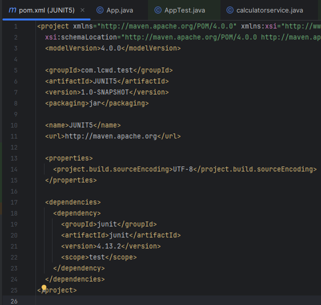
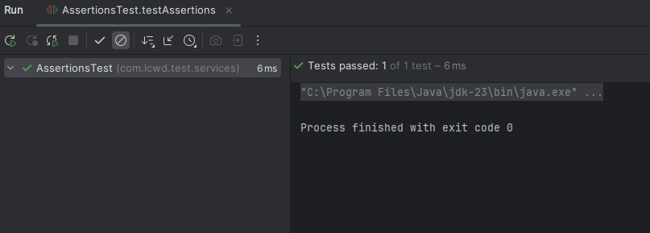
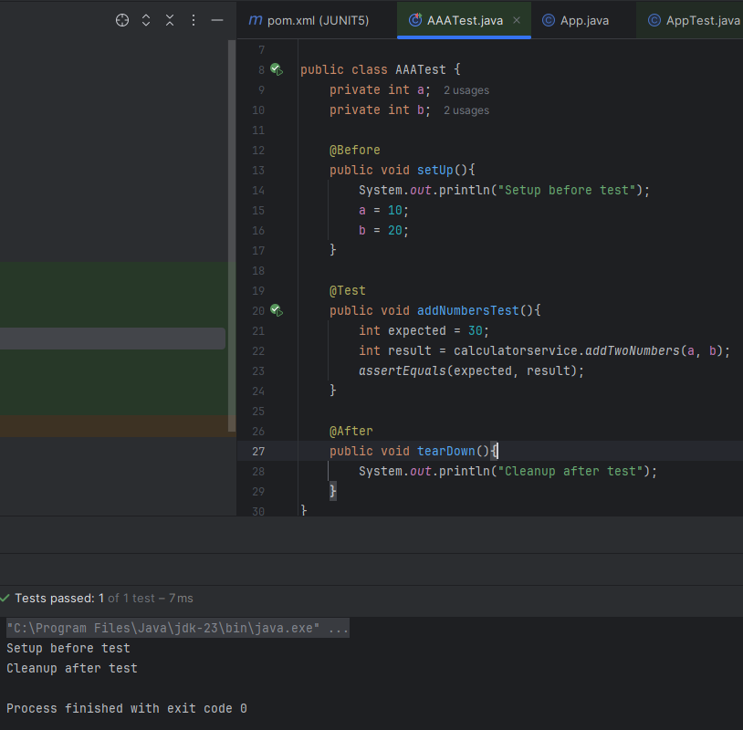
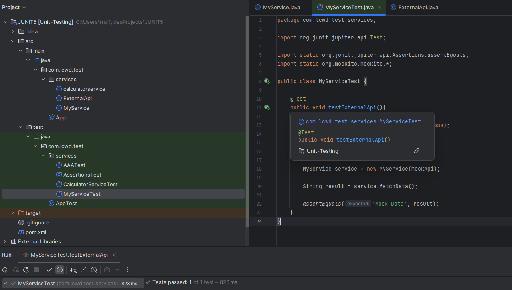
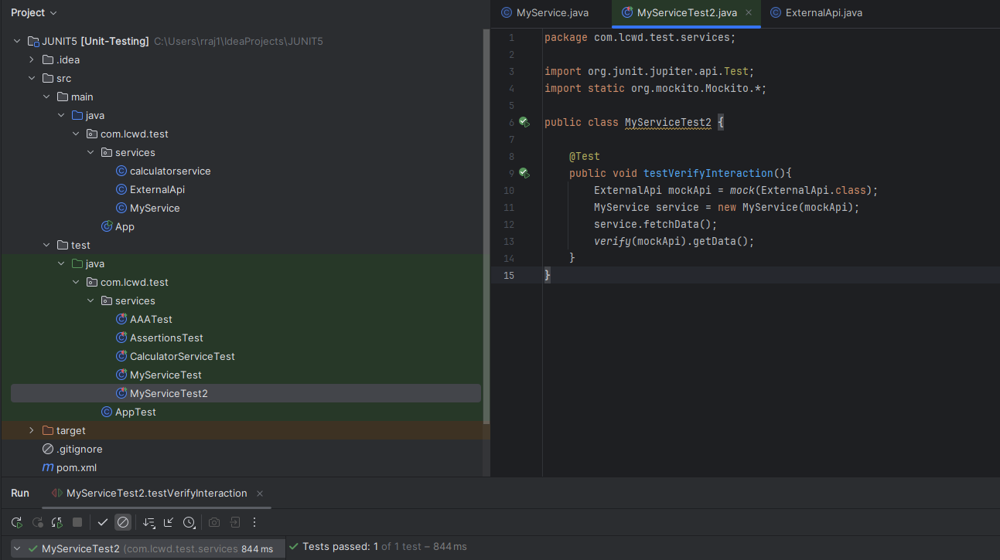

# Execution Output 👌

## Singleton Pattern

## Factory Method Pattern

## E-commerce Search

## Financial Forecasting

## Logging using SLF4J

## JUnit Testing

### Setting Up JUnit

### Assertions in JUnit

### Arrange-Act-Assert (AAA) Pattern

## Mockito Testing

### Mocking & Stubbing

### Verifying Interaction

