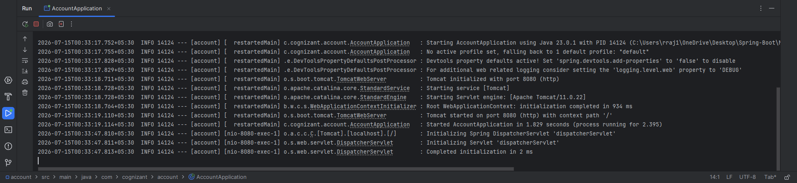
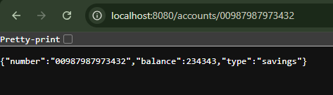
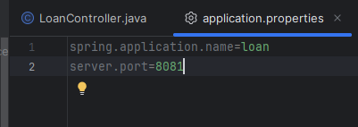
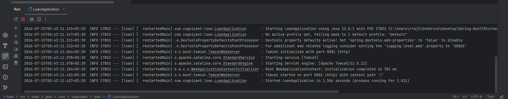
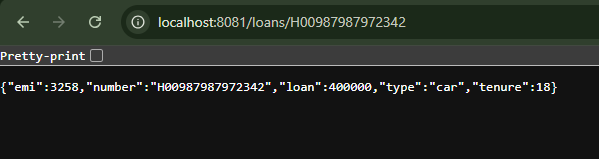

# Execution Output 👌

## Account Microservice

#### 1. Console Output (Account - Port 8080)

---

#### 2. Browser Output

---

## Loan Microservice

#### 1. application.properties (Server Port Configuration)

---

#### 2. Console Output (Loan - Port 8081)

---

#### 3. Browser Output

