# Execution Output 👌

# -> ReactJS-HOL

## 9. ReactJS-HOL

## flag = True :

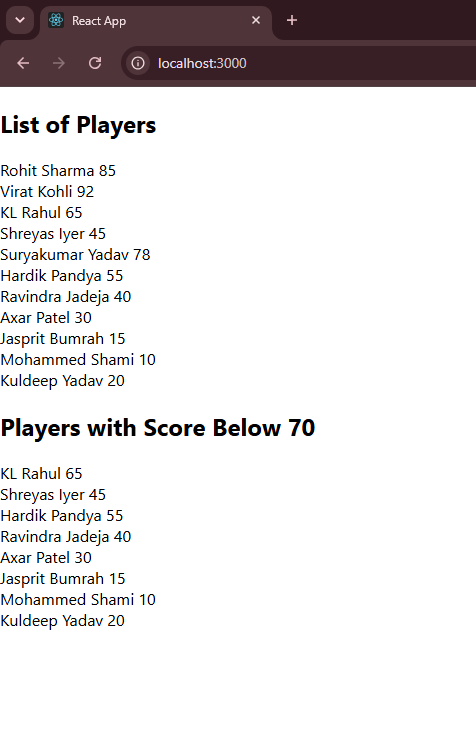

## flag = False:

---

## 10. ReactJS-HOL

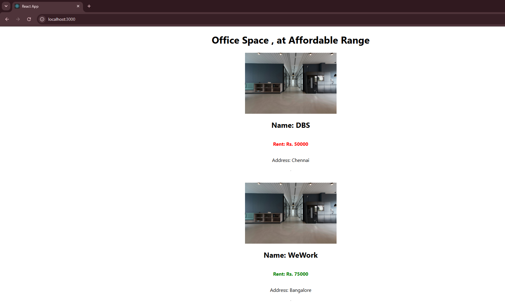

---

## 11. ReactJS-HOL

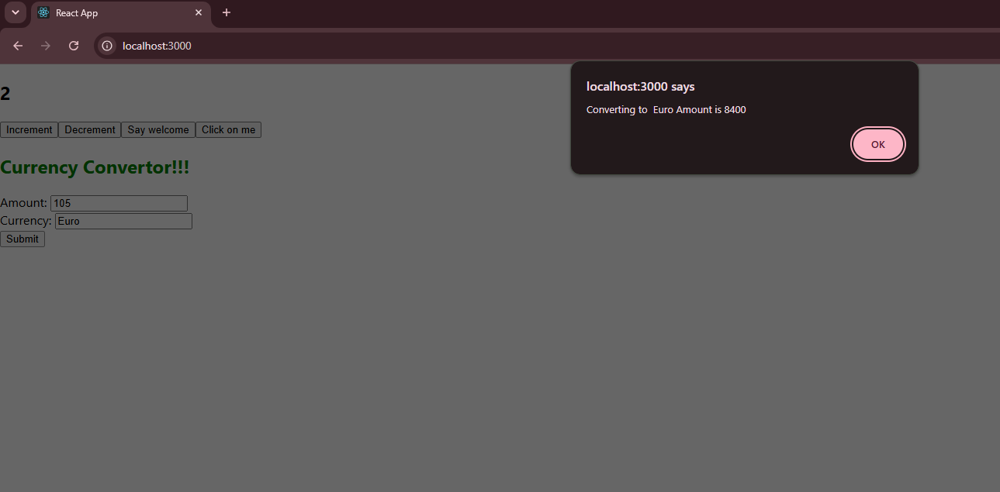

---

## 12. ReactJS-HOL

## Login 

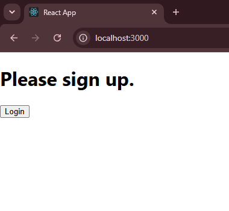

## Logout

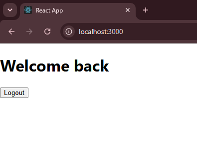

---

## 13. ReactJS-HOL

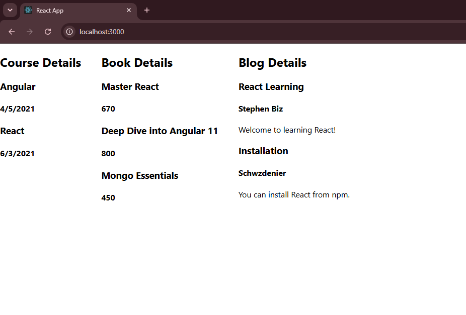

# -> GIT-HOL

## 1. GIT-HOL

### Gitbash 

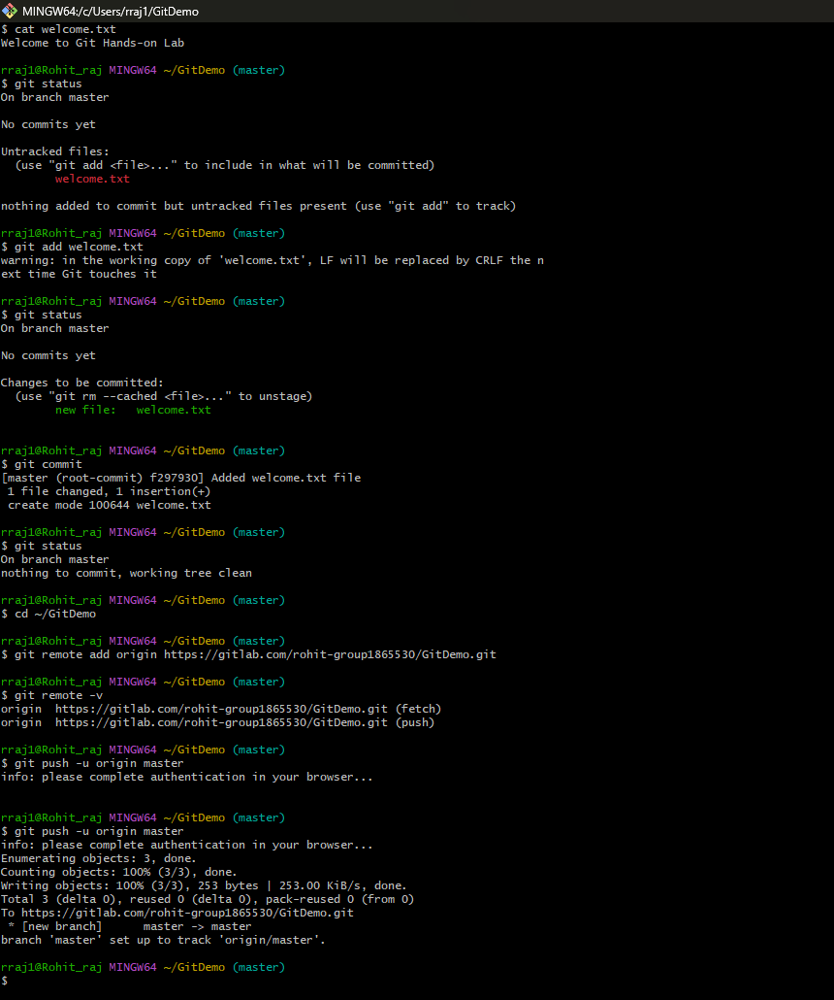

### Notepad++

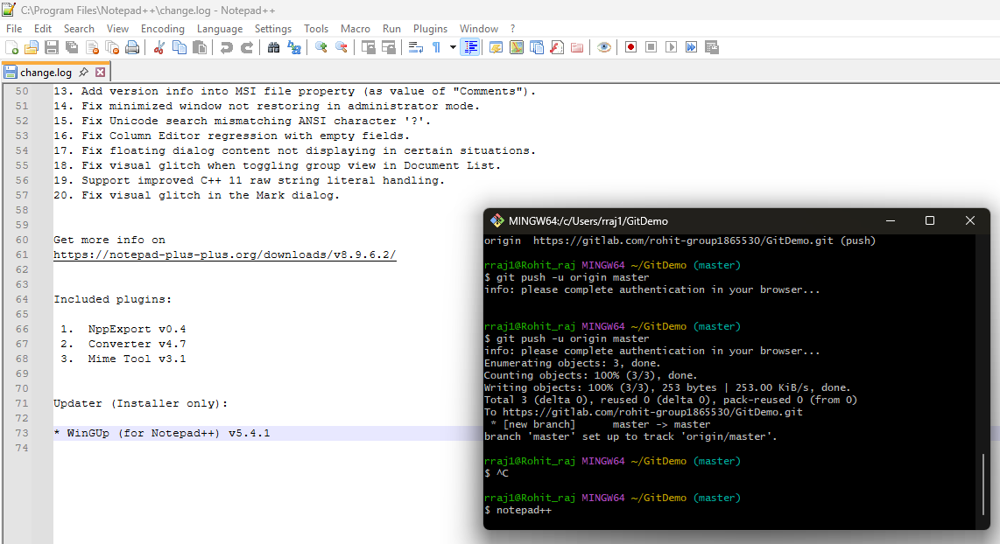

---

## 2. GIT-HOL

### Gitbash

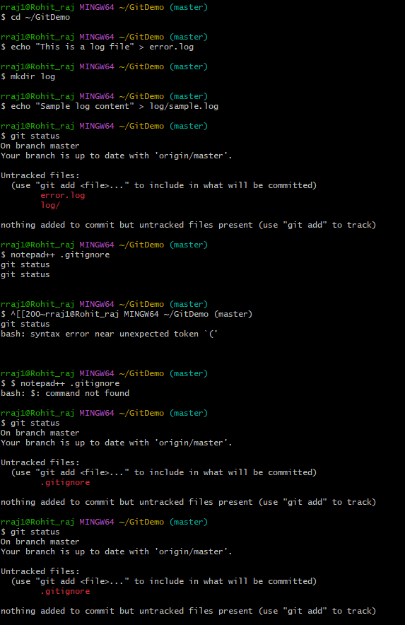

---

### Commit and push

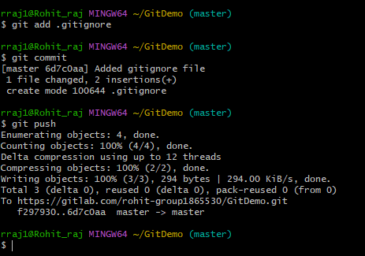

---

## 3. GIT-HOL

### Gitbash

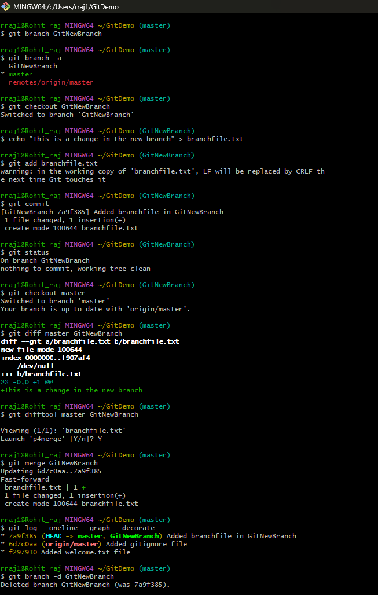

---

### P4Merge

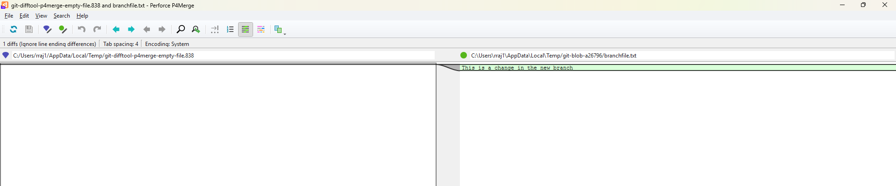

---

## 4. GIT-HOL

### Git Bash - Merge Conflict Resolution

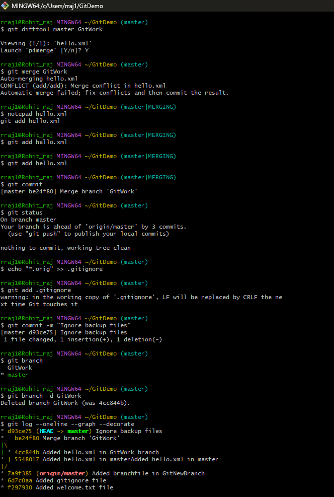

---

### P4Merge - Conflict Resolution

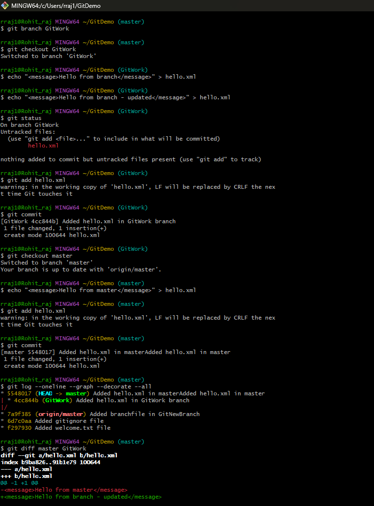